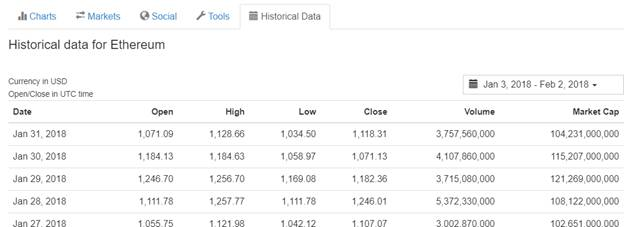
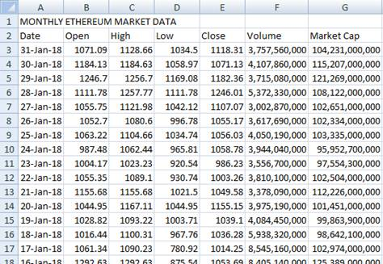

# BeautifulSoup_WebScraper
Python script to parse through historical Ethereum market prices on Coinmarketcap.com and write the results to a csv file. 

<b>Overview:</b> Creates a BeautifulSoup object from the HTML on Coinmarketcap.com for historical Ethereum prices.  findAll() is used to narrow down to all <td> fields, which captures all the needed data.  The .contents() of each <td> tag are extracted and moved into a regular python list so the .pop() function could be performed in the subsequent code. 
 
<b>Pre-requisites:</b>
<ul>
<li> Python v3.x </li>
<li> IDLE (or any other IDE of your choosing) </li>
<li> requests module </li>
<li> beautifulsoup4 module </li>
</ul>
<b> Source Data </b> 

<b> Output – CSV file saved to directory where script is ran </b> 

<b> Output – CSV file </b> 
 
<b> Next Steps: </b>
